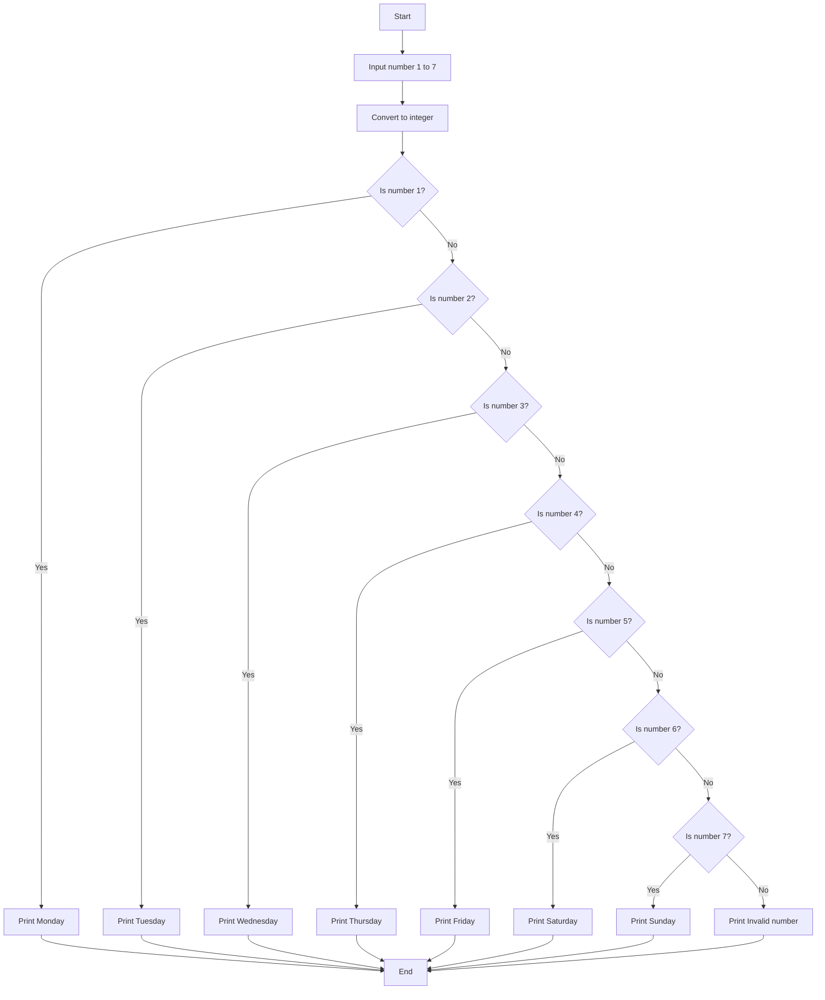

```mermaid
flowchart TD
    A[Start] --> B[Input number 1 to 7]
    B --> C[Convert to integer]
    C --> D{Is number 1?}
    D -- Yes --> E[Print Monday]
    D -- No --> F{Is number 2?}
    F -- Yes --> G[Print Tuesday]
    F -- No --> H{Is number 3?}
    H -- Yes --> I[Print Wednesday]
    H -- No --> J{Is number 4?}
    J -- Yes --> K[Print Thursday]
    J -- No --> L{Is number 5?}
    L -- Yes --> M[Print Friday]
    L -- No --> N{Is number 6?}
    N -- Yes --> O[Print Saturday]
    N -- No --> P{Is number 7?}
    P -- Yes --> Q[Print Sunday]
    P -- No --> R[Print Invalid number]
    E --> S[End]
    G --> S
    I --> S
    K --> S
    M --> S
    O --> S
    Q --> S
    R --> S
```