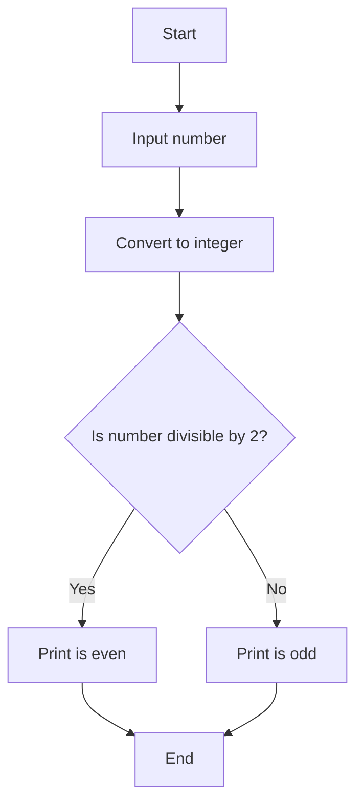

```mermaid
flowchart TD
    A[Start] --> B[Input number]
    B --> C[Convert to integer]
    C --> D{Is number divisible by 2?}
    D -- Yes --> E[Print is even]
    D -- No --> F[Print is odd]
    E --> G[End]
    F --> G
```