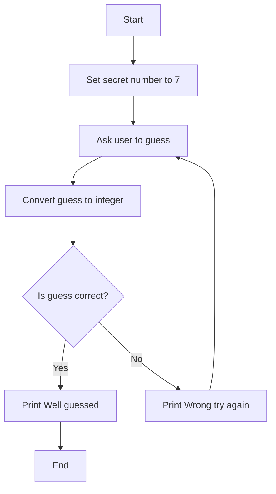

```mermaid
flowchart TD
    A[Start] --> B[Set secret number to 7]
    B --> C[Ask user to guess]
    C --> D[Convert guess to integer]
    D --> E{Is guess correct?}
    E -- Yes --> F[Print Well guessed]
    F --> G[End]
    E -- No --> H[Print Wrong try again]
    H --> C
```