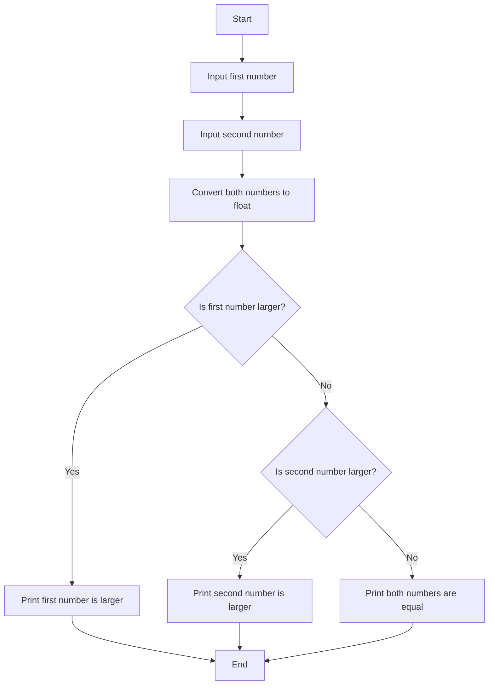

```mermaid
flowchart TD
    A[Start] --> B[Input first number]
    B --> C[Input second number]
    C --> D[Convert both numbers to float]
    D --> E{Is first number larger?}
    E -- Yes --> F[Print first number is larger]
    E -- No --> G{Is second number larger?}
    G -- Yes --> H[Print second number is larger]
    G -- No --> I[Print both numbers are equal]
    F --> J[End]
    H --> J
    I --> J
```