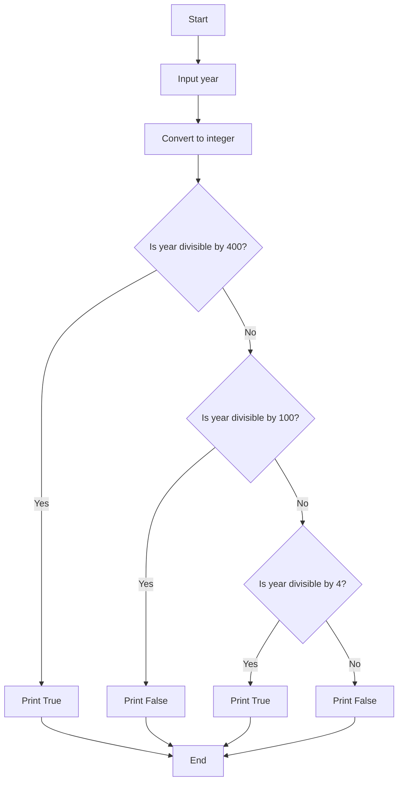

```mermaid
flowchart TD
    A[Start] --> B[Input year]
    B --> C[Convert to integer]
    C --> D{Is year divisible by 400?}
    D -- Yes --> E[Print True]
    D -- No --> F{Is year divisible by 100?}
    F -- Yes --> G[Print False]
    F -- No --> H{Is year divisible by 4?}
    H -- Yes --> I[Print True]
    H -- No --> J[Print False]
    E --> K[End]
    G --> K
    I --> K
    J --> K
```