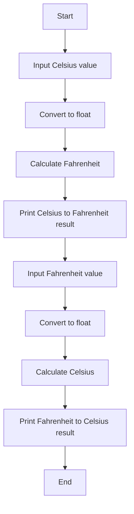

```mermaid
flowchart TD
    A[Start] --> B[Input Celsius value]
    B --> C[Convert to float]
    C --> D[Calculate Fahrenheit]
    D --> E[Print Celsius to Fahrenheit result]
    E --> F[Input Fahrenheit value]
    F --> G[Convert to float]
    G --> H[Calculate Celsius]
    H --> I[Print Fahrenheit to Celsius result]
    I --> J[End]
```