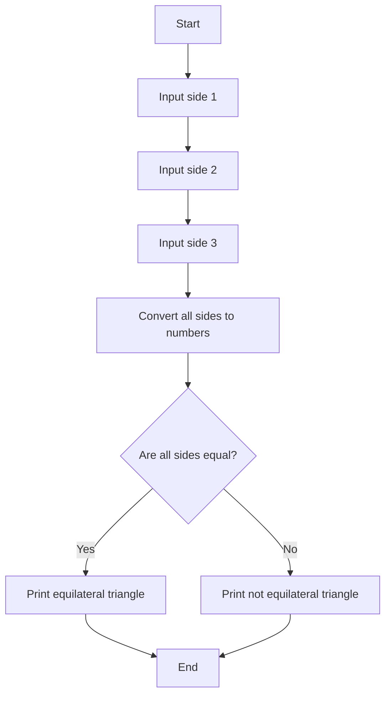

```mermaid
flowchart TD
    A[Start] --> B[Input side 1]
    B --> C[Input side 2]
    C --> D[Input side 3]
    D --> E[Convert all sides to numbers]
    E --> F{Are all sides equal?}
    F -- Yes --> G[Print equilateral triangle]
    F -- No --> H[Print not equilateral triangle]
    G --> I[End]
    H --> I
```