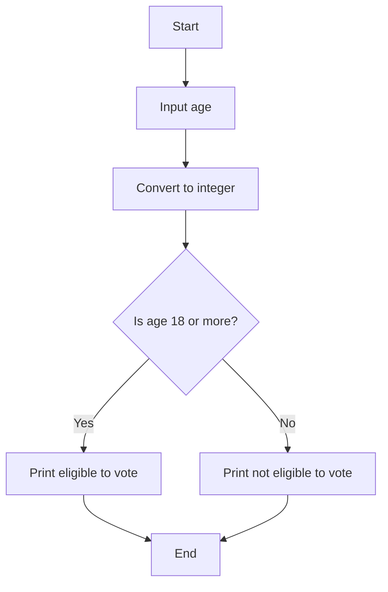

```mermaid
flowchart TD
    A[Start] --> B[Input age]
    B --> C[Convert to integer]
    C --> D{Is age 18 or more?}
    D -- Yes --> E[Print eligible to vote]
    D -- No --> F[Print not eligible to vote]
    E --> G[End]
    F --> G
```