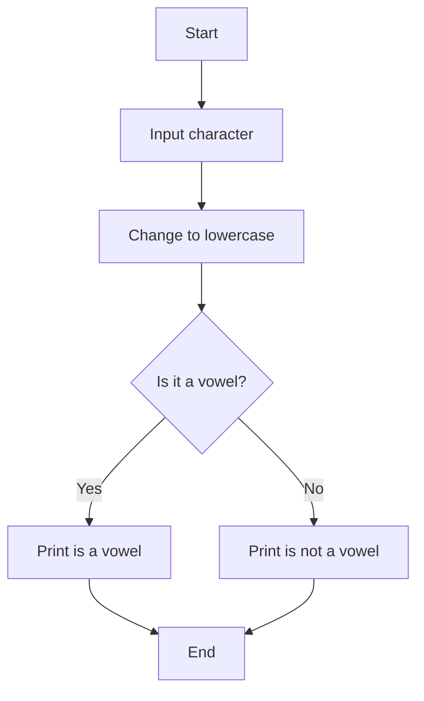

```mermaid
flowchart TD
    A[Start] --> B[Input character]
    B --> C[Change to lowercase]
    C --> D{Is it a vowel?}
    D -- Yes --> E[Print is a vowel]
    D -- No --> F[Print is not a vowel]
    E --> G[End]
    F --> G
```