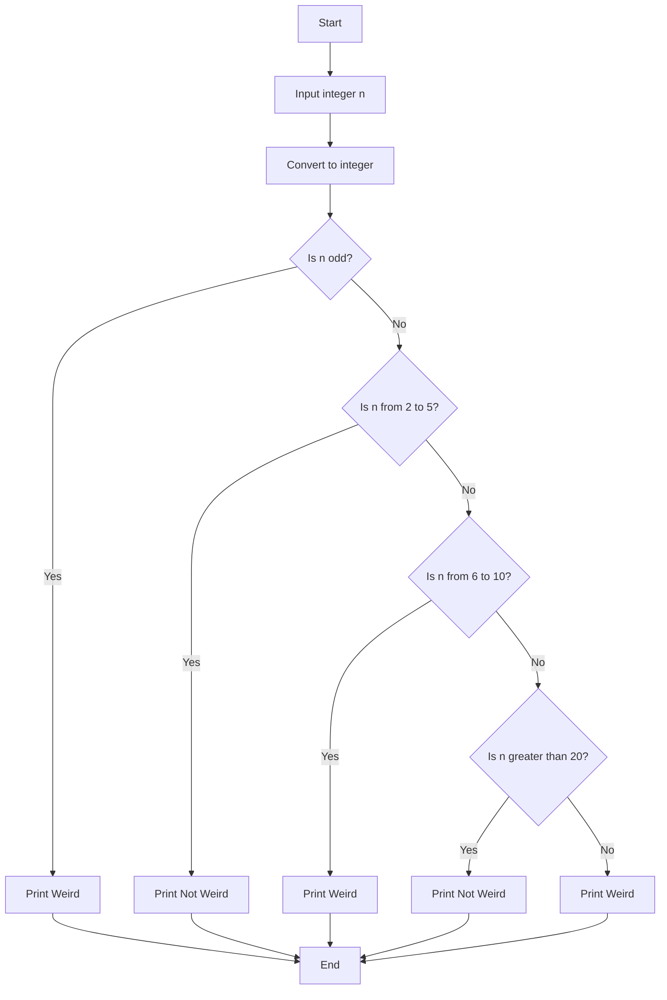

```mermaid
flowchart TD
    A[Start] --> B[Input integer n]
    B --> C[Convert to integer]
    C --> D{Is n odd?}
    D -- Yes --> E[Print Weird]
    D -- No --> F{Is n from 2 to 5?}
    F -- Yes --> G[Print Not Weird]
    F -- No --> H{Is n from 6 to 10?}
    H -- Yes --> I[Print Weird]
    H -- No --> J{Is n greater than 20?}
    J -- Yes --> K[Print Not Weird]
    J -- No --> L[Print Weird]
    E --> M[End]
    G --> M
    I --> M
    K --> M
    L --> M
```